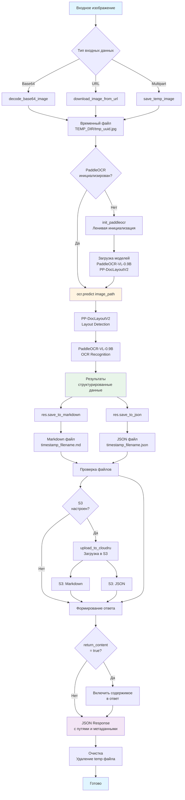
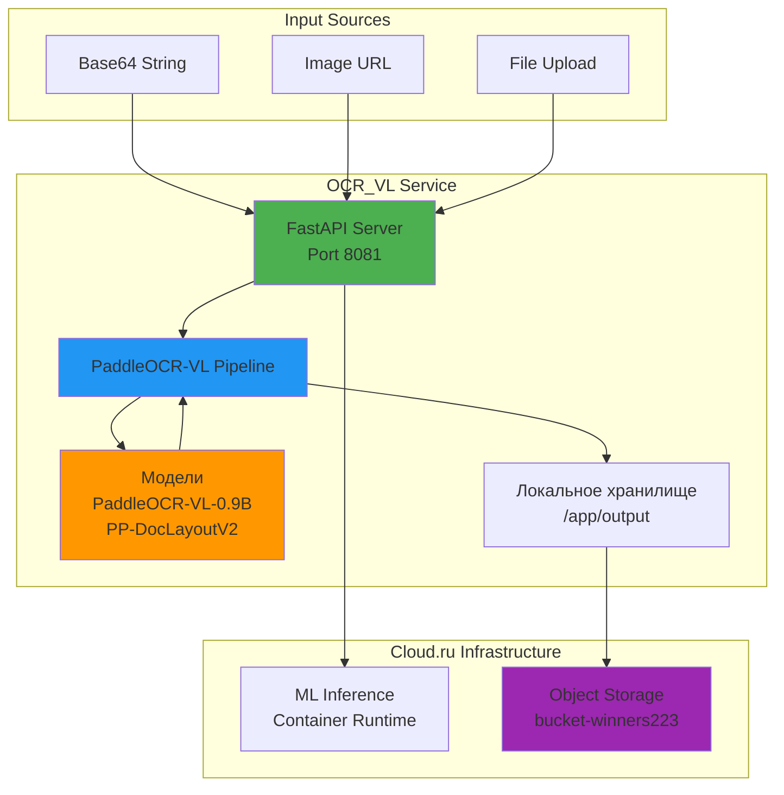
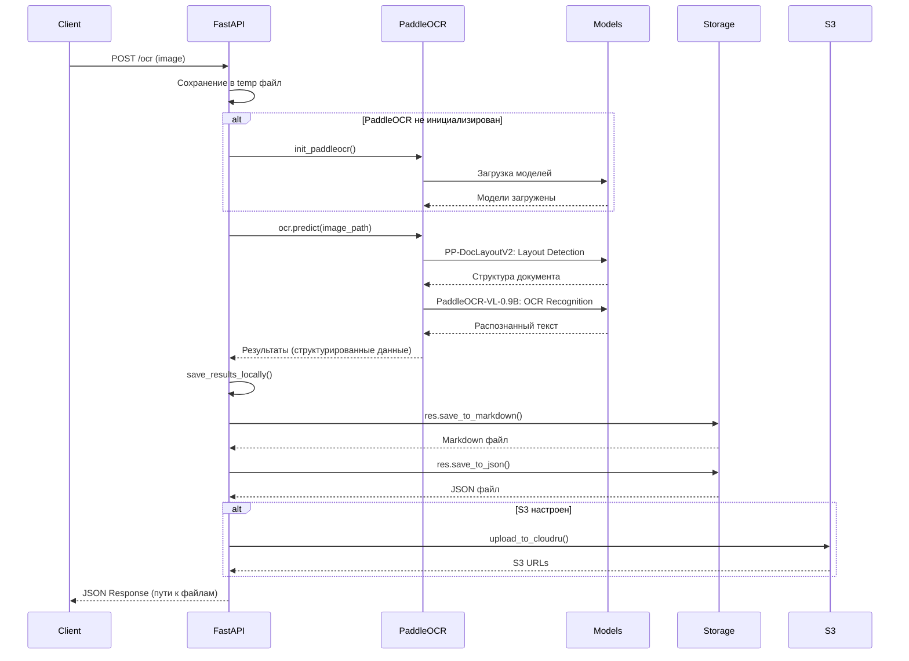
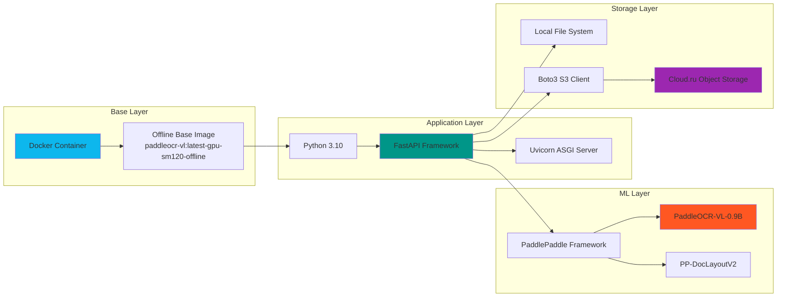

# Визуализация Pipeline PaddleOCR-VL

## Архитектура Pipeline

```mermaid
flowchart TD
    Start[Входное изображение] --> InputType{Тип входных данных}
    
    InputType -->|Base64| Decode[decode_base64_image]
    InputType -->|URL| Download[download_image_from_url]
    InputType -->|Multipart| SaveFile[save_temp_image]
    
    Decode --> TempFile[Временный файл<br/>TEMP_DIR/tmp_uuid.jpg]
    Download --> TempFile
    SaveFile --> TempFile
    
    TempFile --> InitOCR{PaddleOCR<br/>инициализирован?}
    
    InitOCR -->|Нет| LazyInit[init_paddleocr<br/>Ленивая инициализация]
    InitOCR -->|Да| Process
    
    LazyInit --> LoadModels[Загрузка моделей<br/>PaddleOCR-VL-0.9B<br/>PP-DocLayoutV2]
    LoadModels --> Process[ocr.predict image_path]
    
    Process --> Layout[PP-DocLayoutV2<br/>Layout Detection]
    Layout --> OCR[PaddleOCR-VL-0.9B<br/>OCR Recognition]
    OCR --> Results[Результаты<br/>структурированные данные]
    
    Results --> SaveMD[res.save_to_markdown]
    Results --> SaveJSON[res.save_to_json]
    
    SaveMD --> MDFile[Markdown файл<br/>timestamp_filename.md]
    SaveJSON --> JSONFile[JSON файл<br/>timestamp_filename.json]
    
    MDFile --> Verify[Проверка файлов]
    JSONFile --> Verify
    
    Verify --> S3Check{S3<br/>настроен?}
    
    S3Check -->|Да| UploadS3[upload_to_cloudru<br/>Загрузка в S3]
    S3Check -->|Нет| Response
    
    UploadS3 --> S3MD[S3: Markdown]
    UploadS3 --> S3JSON[S3: JSON]
    
    S3MD --> Response[Формирование ответа]
    S3JSON --> Response
    Verify --> Response
    
    Response --> ReturnContent{return_content<br/>= true?}
    
    ReturnContent -->|Да| IncludeContent[Включить содержимое<br/>в ответ]
    ReturnContent -->|Нет| FinalResponse
    
    IncludeContent --> FinalResponse[JSON Response<br/>с путями и метаданными]
    
    FinalResponse --> Cleanup[Очистка<br/>Удаление temp файла]
    Cleanup --> End[Готово]
    
    style Start fill:#e1f5ff
    style Process fill:#fff4e1
    style Results fill:#e8f5e9
    style FinalResponse fill:#f3e5f5
    style End fill:#e1f5ff
```

## Компоненты системы

```mermaid
graph TB
    subgraph "OCR_VL Service"
        FastAPI[FastAPI Server<br/>Port 8081]
        PaddleOCR[PaddleOCR-VL Pipeline]
        Models[Модели<br/>PaddleOCR-VL-0.9B<br/>PP-DocLayoutV2]
        Storage[Локальное хранилище<br/>/app/output]
    end
    
    subgraph "Cloud.ru Infrastructure"
        MLInference[ML Inference<br/>Container Runtime]
        S3Storage[Object Storage<br/>bucket-winners223]
    end
    
    subgraph "Input Sources"
        Base64[Base64 String]
        URL[Image URL]
        Multipart[File Upload]
    end
    
    Base64 --> FastAPI
    URL --> FastAPI
    Multipart --> FastAPI
    
    FastAPI --> PaddleOCR
    PaddleOCR --> Models
    Models --> PaddleOCR
    PaddleOCR --> Storage
    
    FastAPI --> MLInference
    Storage --> S3Storage
    
    style FastAPI fill:#4CAF50
    style PaddleOCR fill:#2196F3
    style Models fill:#FF9800
    style S3Storage fill:#9C27B0
```

## Поток данных

```mermaid
sequenceDiagram
    participant Client
    participant FastAPI
    participant PaddleOCR
    participant Models
    participant Storage
    participant S3
    
    Client->>FastAPI: POST /ocr (image)
    FastAPI->>FastAPI: Сохранение в temp файл
    
    alt PaddleOCR не инициализирован
        FastAPI->>PaddleOCR: init_paddleocr()
        PaddleOCR->>Models: Загрузка моделей
        Models-->>PaddleOCR: Модели загружены
    end
    
    FastAPI->>PaddleOCR: ocr.predict(image_path)
    PaddleOCR->>Models: PP-DocLayoutV2: Layout Detection
    Models-->>PaddleOCR: Структура документа
    PaddleOCR->>Models: PaddleOCR-VL-0.9B: OCR Recognition
    Models-->>PaddleOCR: Распознанный текст
    PaddleOCR-->>FastAPI: Результаты (структурированные данные)
    
    FastAPI->>FastAPI: save_results_locally()
    FastAPI->>Storage: res.save_to_markdown()
    Storage-->>FastAPI: Markdown файл
    FastAPI->>Storage: res.save_to_json()
    Storage-->>FastAPI: JSON файл
    
    alt S3 настроен
        FastAPI->>S3: upload_to_cloudru()
        S3-->>FastAPI: S3 URLs
    end
    
    FastAPI-->>Client: JSON Response (пути к файлам)
```

## Технологический стек

```mermaid
graph LR
    subgraph "Base Layer"
        Docker[Docker Container]
        OfflineImage[Offline Base Image<br/>paddleocr-vl:latest-gpu-sm120-offline]
    end
    
    subgraph "Application Layer"
        Python[Python 3.10]
        FastAPI[FastAPI Framework]
        Uvicorn[Uvicorn ASGI Server]
    end
    
    subgraph "ML Layer"
        PaddlePaddle[PaddlePaddle Framework]
        PaddleOCRVL[PaddleOCR-VL-0.9B]
        DocLayout[PP-DocLayoutV2]
    end
    
    subgraph "Storage Layer"
        LocalFS[Local File System]
        S3Client[Boto3 S3 Client]
        CloudRuS3[Cloud.ru Object Storage]
    end
    
    Docker --> OfflineImage
    OfflineImage --> Python
    Python --> FastAPI
    FastAPI --> Uvicorn
    FastAPI --> PaddlePaddle
    PaddlePaddle --> PaddleOCRVL
    PaddlePaddle --> DocLayout
    FastAPI --> LocalFS
    FastAPI --> S3Client
    S3Client --> CloudRuS3
    
    style Docker fill:#0db7ed
    style FastAPI fill:#009688
    style PaddleOCRVL fill:#FF5722
    style CloudRuS3 fill:#9C27B0
```

