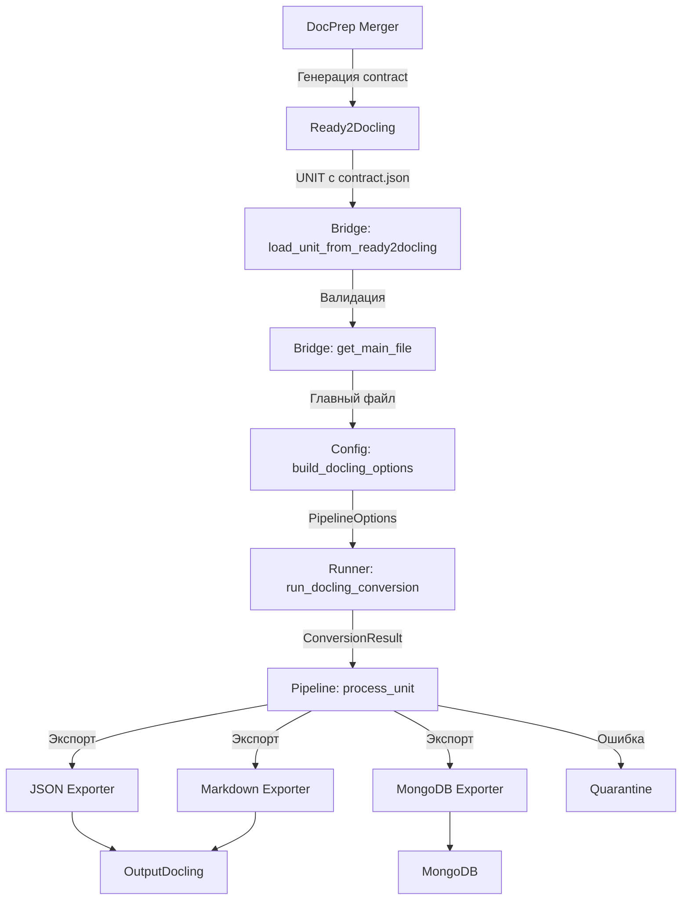

# Архитектура системы Docling Integration

**Дата создания:** 2025-12-24  
**Версия:** 1.0

## Обзор системы

Docling Integration представляет собой систему семантического понимания документов, интегрированную с предобрабатывающим конвейером DocPrep. Система обеспечивает преобразование документов различных форматов в структурированные данные с сохранением layout, таблиц, изображений и метаданных.

### Гибридная архитектура обработки

Система использует гибридный подход к обработке документов:

1. **Ядро (CPU):** `docling-core` с CNN моделями для основной обработки
2. **Внешние сервисы (GPU):** Cloud.ru ML Foundation для улучшения качества:
   - **Granite Docling** - улучшение понимания документов через VLM
   - **PaddleOCR_VLM** - OCR обработка для PDF через GPU-ускоренный сервис

Эта архитектура позволяет использовать локальные CPU ресурсы для основной обработки и масштабироваться на GPU-сервисы Cloud.ru для ресурсоемких задач (OCR, VLM inference).

## Общая схема системы

```
┌─────────────┐
│   DocPrep   │  Классификация, конвертация, нормализация
│  Pipeline   │
└──────┬──────┘
       │
       ▼
┌─────────────────┐
│ Ready2Docling   │  Финальная сборка UNIT с контрактами
│                 │  Структура: {extension}/{unit_id}/
└────────┬────────┘
         │
         │ docprep.contract.json
         │ (контрактная граница)
         ▼
┌─────────────────────┐
│ Docling Integration │  Обработка через IBM Docling
│     Pipeline        │  - Bridge (загрузка UNIT)
│                     │  - Config (YAML templates)
│                     │  - Runner (DocumentConverter)
│                     │  - External Services (Cloud.ru)
│                     │    • Granite Docling (VLM)
│                     │    • PaddleOCR_VLM (OCR)
│                     │  - Exporters (JSON/MD/MongoDB)
└──────────┬──────────┘
           │
           ▼
┌─────────────────┐
│ OutputDocling   │  Результаты обработки
│                 │  Структура: {extension}/{unit_id}/
│  - JSON         │
│  - Markdown     │
│  - MongoDB      │
└─────────────────┘
```

## Основные этапы обработки

### 1. Подготовка (DocPrep)

**Компонент:** `final_preprocessing/docprep/engine/merger.py`

- Сборка UNIT из различных источников (Merge_0/Direct, Merge_1, Merge_2, Merge_3)
- Фильтрация неподдерживаемых форматов (архивы, бинарные файлы, mixed route)
- Сортировка по расширениям: `docx/`, `pdf/`, `xlsx/`, `html/`, `image/`, и т.д.
- Генерация `docprep.contract.json` для каждого UNIT

**Результат:** Готовые UNIT в `Ready2Docling/{extension}/{unit_id}/`

### 2. Загрузка и валидация (Bridge)

**Компонент:** `final_preprocessing/docling_integration/bridge_docprep.py`

- Загрузка UNIT из Ready2Docling
- Валидация готовности через `DoclingAdapter`
- Загрузка и валидация `docprep.contract.json`
- Получение главного файла для обработки (через AST nodes или приоритет расширений)

**Результат:** Валидированные данные UNIT с контрактом и главным файлом

### 3. Конфигурация (Config)

**Компонент:** `final_preprocessing/docling_integration/config.py`

- Загрузка YAML template для route из `pipeline_templates/`
- Построение `PipelineOptions` из template
- Маппинг route → `InputFormat`
- Настройка VLM pipeline (если указан)
- Fallback на legacy hardcoded конфигурацию

**Результат:** `PipelineOptions` для DocumentConverter

### 4. Обработка (Runner)

**Компонент:** `final_preprocessing/docling_integration/runner.py`

- Инициализация `DocumentConverter` с `PipelineOptions`
- Вызов `converter.convert(file_path)` для конвертации
- Интеграция с внешними сервисами (Cloud.ru):
  - **Granite Docling** - для улучшения понимания через VLM (опционально)
  - **PaddleOCR_VLM** - для OCR обработки PDF через GPU (опционально)
- Retry механизм при ошибках
- Batch обработка (опционально)

**Результат:** `ConversionResult` с `DoclingDocument`

**Примечание:** Внешние сервисы подключаются на этапе рефакторинга после отладки обработки digital документов.

### 5. Экспорт (Exporters)

**Компоненты:** `exporters/json.py`, `exporters/markdown.py`, `exporters/mongodb.py`

- **JSON:** Сериализация через `model_dump()` в `OutputDocling/{extension}/{unit_id}/{unit_id}.json`
- **Markdown:** Структурированный экспорт с сохранением layout в `OutputDocling/{extension}/{unit_id}/{unit_id}.md`
- **MongoDB:** Сохранение в коллекцию `docling_results` с индексами

**Результат:** Экспортированные данные в различных форматах

### 6. Обработка ошибок (Quarantine)

**Компонент:** `final_preprocessing/docling_integration/pipeline.py` (метод `_quarantine_unit`)

- Определение неподдерживаемых форматов
- Копирование проблемных UNIT в `Quarantine/{unit_id}/`
- Создание `error_info.txt` с описанием ошибки

## Диаграмма потоков данных



## Контрактная модель

### docprep.contract.json как граница систем

`docprep.contract.json` является **формализованным контрактом** между DocPrep и Docling Integration, обеспечивающим:

1. **Контрактную строгость:** Docling использует ТОЛЬКО contract.json, manifest.json НЕ используется как вход
2. **Однозначность:** Все метаданные и маршрутизация определяются в контракте
3. **Валидацию:** Contract валидируется перед обработкой, route не должен быть "mixed"

### Структура контракта

```json
{
  "unit": {
    "unit_id": "UNIT_xxx",
    "batch_date": "2025-03-04"
  },
  "source": {
    "original_filename": "document.pdf",
    "true_extension": "pdf",
    "file_size": 12345,
    "checksum": "sha256:..."
  },
  "routing": {
    "docling_route": "pdf_text"
  },
  "processing": {
    "cost_estimation": {
      "cpu_seconds_estimate": 10,
      "cost_usd_estimate": 0.000139
    }
  }
}
```

### Валидация контракта

- Route не должен быть "mixed" или "unknown"
- Должен быть определен главный файл
- `docling_route` должен соответствовать поддерживаемым форматам

## Взаимодействие компонентов

### DoclingPipeline (orchestration)

**Файл:** `final_preprocessing/docling_integration/pipeline.py`

Класс `DoclingPipeline` координирует все этапы обработки:

1. Инициализация с настройками экспорта (JSON, Markdown, MongoDB)
2. Определение базовых директорий (Ready2Docling, OutputDocling, Quarantine)
3. Метод `process_unit()` - обработка одного UNIT
4. Метод `process_directory()` - массовая обработка всех UNIT

### Последовательность вызовов

```python
# 1. Инициализация pipeline
pipeline = DoclingPipeline(
    export_json=True,
    export_markdown=True,
    export_mongodb=False,
    base_output_dir=Path("Data/2025-03-04/OutputDocling"),
    ready2docling_dir=Path("Data/2025-03-04/Ready2Docling"),
    quarantine_dir=Path("Data/2025-03-04/Quarantine"),
)

# 2. Обработка UNIT
result = pipeline.process_unit(unit_path)

# Внутри process_unit():
#   - load_unit_from_ready2docling() -> unit_data
#   - get_main_file(unit_data) -> main_file
#   - build_docling_options(route) -> options
#   - run_docling_conversion(main_file, options) -> document
#   - export_to_json(document, json_path)
#   - export_to_markdown(document, md_path)
#   - export_to_mongodb(document, contract) (опционально)
```

## Структура директорий

### Ready2Docling

```
Ready2Docling/
├── docx/
│   └── UNIT_xxx/
│       ├── files/
│       │   └── document.docx
│       ├── docprep.contract.json
│       └── manifest.json (не используется Docling)
├── pdf/
│   └── UNIT_yyy/
│       ├── files/
│       │   └── document.pdf
│       └── docprep.contract.json
└── xlsx/
    └── UNIT_zzz/
        └── ...
```

### OutputDocling

```
OutputDocling/
├── docx/
│   └── UNIT_xxx/
│       ├── UNIT_xxx.json
│       └── UNIT_xxx.md
├── pdf/
│   └── UNIT_yyy/
│       ├── UNIT_yyy.json
│       └── UNIT_yyy.md
└── xlsx/
    └── ...
```

### Quarantine

```
Quarantine/
└── UNIT_xxx/
    ├── files/
    ├── docprep.contract.json
    └── error_info.txt
```

## Зависимости между компонентами

### DocPrep → Docling Integration

- **Данные:** UNIT директории с файлами
- **Контракт:** `docprep.contract.json` (обязателен)
- **Интерфейс:** `DoclingAdapter` для валидации готовности

### Docling Integration → Docling Library

- **API:** `DocumentConverter` класс
- **Конфигурация:** `PipelineOptions`, `PdfPipelineOptions`, `VlmPipelineOptions`
- **Результат:** `ConversionResult` с `DoclingDocument`

### Docling Integration → External Services (Cloud.ru)

- **Granite Docling:**
  - **Тип:** ML Foundation Model Run
  - **Использование:** VLM inference для улучшения понимания документов
  - **Интеграция:** Через VLM pipeline options в Docling
  - **Endpoint:** Настраивается через environment variables
  
- **PaddleOCR_VLM:**
  - **Тип:** ML Foundation Docker Run
  - **Использование:** OCR обработка PDF файлов через GPU
  - **Интеграция:** Через внешний API (планируется в следующем этапе рефакторинга)
  - **Endpoint:** Настраивается через environment variables

### Docling Integration → Exporters

- **Вход:** `ConversionResult` / `DoclingDocument`
- **Конфигурация:** Настройки экспорта (JSON, Markdown, MongoDB)
- **Выход:** Файлы в OutputDocling или записи в MongoDB

## Обработка ошибок

### Типы ошибок

1. **Ошибки валидации:** Contract отсутствует или некорректен
2. **Ошибки конвертации:** Docling не может обработать файл
3. **Ошибки экспорта:** Не удалось сохранить результаты
4. **Неподдерживаемые форматы:** Файлы, которые должны были быть отфильтрованы в merger

### Стратегия обработки

- **Валидация:** Ошибки валидации прерывают обработку UNIT
- **Конвертация:** Retry механизм (по умолчанию 1 попытка)
- **Экспорт:** Ошибки экспорта логируются, но не прерывают обработку
- **Quarantine:** Проблемные UNIT копируются в Quarantine с описанием ошибки

## Гибридная архитектура обработки

### Текущая архитектура (CPU-only)

- Ядро: `docling-core` с CNN моделями на CPU
- Последовательная обработка UNIT
- Один процесс на UNIT
- Локальная обработка без внешних сервисов

### Планируемая гибридная архитектура (CPU + GPU сервисы)

**Этап 1 (текущий):** Отладка обработки digital документов
- Использование только `docling-core` на CPU
- Обработка всех форматов через локальные модели

**Этап 2 (следующий этап рефакторинга):** Интеграция внешних GPU-сервисов
- **Core (CPU):** `docling-core` для основной обработки
- **External Services (GPU):**
  - **Cloud.ru Granite Docling** - для улучшения понимания через VLM
  - **Cloud.ru PaddleOCR_VLM** - для OCR обработки PDF через GPU
  
**Преимущества гибридной архитектуры:**
- Эффективное использование ресурсов (CPU для основной обработки, GPU для тяжелых задач)
- Масштабируемость через внешние сервисы
- Оптимизация затрат (GPU только для ресурсоемких задач)

## Масштабирование

### Текущая архитектура

- Последовательная обработка UNIT
- Один процесс на UNIT
- Нет распределенной обработки

### Потенциальные улучшения

1. **Параллельная обработка:** Многопоточная/многопроцессная обработка UNIT
2. **Batch processing:** Группировка UNIT для оптимизации
3. **Распределенная обработка:** Очереди задач (Celery, RabbitMQ)
4. **Кэширование:** Сохранение результатов для повторной обработки
5. **Гибридная обработка:** CPU для основной логики, GPU-сервисы для тяжелых задач

---

**Следующий документ:** [COMPONENTS.md](COMPONENTS.md) - детальное описание всех компонентов системы
