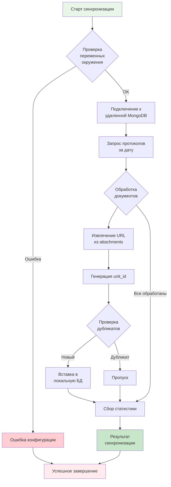

# АНАЛИЗ СИНХРОНИЗАЦИИ ПРОТОКОЛОВ ПОБЕДИТЕЛЕЙ

## Обзор процесса

Синхронизация протоколов победителей - это процесс извлечения закупочных протоколов из удаленной MongoDB базы данных `protocols223.purchaseProtocol` и сохранения их в локальную базу данных `docling_metadata.protocols` для последующего скачивания документов.

**Ключевые особенности:**
- Использует **прямое подключение** к MongoDB через VPN (192.168.0.46:8635)
- Работает в составе первого компонента препроцессинга
- Предотвращает дубликаты по `purchaseNoticeNumber` и `source`
- Генерирует уникальные `unit_id` в формате `UNIT_<16hex>`
- Аутентификация через `authSource=protocols223`

## Архитектура синхронизации

```mermaid
flowchart TD
    A[Удаленная MongoDB<br/>protocols223.purchaseProtocol] --> B[Protocol Sync Service<br/>router/protocol_sync.py]
    B --> C[Локальная MongoDB<br/>docling_metadata.protocols]

    subgraph "Удаленная MongoDB"
        A1[purchaseProtocol documents]
        A2[purchaseNoticeNumber]
        A3[attachments[]]
        A4[loadDate]
    end

    subgraph "Protocol Sync Service (VPN Direct)"
        B1[get_remote_mongo_mcp_client()]
        B2[sync_protocols_for_date()]
        B3[_extract_urls_from_attachments()]
        B4[_generate_unit_id()]
    end

    subgraph "Локальная MongoDB"
        C1[protocols collection]
        C2[unit_id: UNIT_<16hex>]
        C3[ПОЛНЫЕ ДАННЫЕ ПРОТОКОЛА]
        C4[+ urls[] + служебные поля]
        C5[status: pending]
        C6[source: remote_mongo_direct]
        C7[created_at, updated_at]
    end

    A -->|VPN + SSL/TLS<br/>192.168.0.46:8635<br/>authSource=protocols223| B1
    B1 --> B2
    B2 --> B3
    B3 --> B4
    B4 --> C

    style A fill:#e1f5fe
    style B fill:#f3e5f5
    style C fill:#e8f5e8
```

### Диаграмма процесса синхронизации



## Процесс синхронизации (5 шагов)

Первый компонент препроцессинга выполняет синхронизацию протоколов в 5 этапов:

### 1. Проверка подключения к локальной MongoDB
- Подключение к локальной MongoDB (`localhost:27017`)
- Использование учетных данных из переменных окружения
- Проверка доступности базы данных `docling_metadata`
- Создание необходимых индексов в коллекции `protocols`

### 2. Проверка подключения к удаленной MongoDB
- Подключение к удаленной MongoDB через **VPN** (192.168.0.46:8635)
- Использование SSL/TLS шифрования с сертификатом sber2.crt
- Аутентификация через `authSource=protocols223`
- Проверка доступности MongoDB кластера

### 3. Проверка обновлений в коллекции протоколов
- Запрос документов из `protocols223.purchaseProtocol`
- Фильтрация по дате (`loadDate` за указанный период)
- Извлечение полей: `purchaseNoticeNumber`, `attachments`, `loadDate`
- Применение лимита на количество документов

### 4. Синхронизация коллекций баз данных/обновления локальной MongoDB
- Обработка каждого документа из удаленной БД
- Извлечение URL из поля `attachments.document`
- Генерация уникального `unit_id` в формате `UNIT_<16hex>`
- Проверка на дубликаты по `purchaseNoticeNumber` и `source`
- Вставка новых документов в локальную коллекцию `protocols`

### 5. Отчет с метриками
- Подсчет обработанных документов
- Количество вставленных новых протоколов
- Количество пропущенных дубликатов
- Время выполнения операции
- Список ошибок (если есть)

**Следующий этап:** Скачивание документов по полученным URL протоколам из `zakupki.gov.ru`

## Структура данных MongoDB

### Удаленная MongoDB (protocols223.purchaseProtocol)

#### Документ purchaseProtocol
```javascript
{
  "_id": ObjectId("..."),
  "purchaseInfo": {
    "purchaseNoticeNumber": "01234567890123456789"
  },
  "attachments": {
    "document": [
      {
        "url": "https://zakupki.gov.ru/epz/order/notice/printForm/download.html?regNumber=01234567890123456789",
        "fileName": "Протокол подведения итогов.pdf",
        "guid": "uuid-string",
        "contentUid": "content-uuid",
        "description": "Протокол подведения итогов"
      }
    ]
  },
  "loadDate": ISODate("2024-12-17T12:00:00.000Z")
}
```

#### Альтернативная структура attachments
```javascript
{
  "attachments": [
    {
      "url": "https://zakupki.gov.ru/...",
      "fileName": "protocol.pdf",
      "guid": "uuid",
      "contentUid": "content-uuid",
      "description": "Описание"
    }
  ]
}
```

### Локальная MongoDB (docling_metadata.protocols)

**ОТЛИЧИЕ: Теперь сохраняется ПОЛНАЯ информация протокола!**

#### Документ protocols содержит:
- **ВСЕ ПОЛЯ** из оригинального документа MongoDB protocols223.purchaseProtocol
- **СЛУЖЕБНЫЕ ПОЛЯ** для препроцессинга

```javascript
{
  "_id": ObjectId("..."),

  // СЛУЖЕБНЫЕ ПОЛЯ ПРЕПРОЦЕССИНГА
  "unit_id": "UNIT_a1b2c3d4e5f6789a",
  "urls": [...],           // Извлеченные URLs из attachments
  "multi_url": false,      // true если >1 URL
  "url_count": 1,          // Количество URLs
  "source": "remote_mongo_direct",
  "status": "pending",     // Статус обработки
  "created_at": ISODate("..."),
  "updated_at": ISODate("..."),

  // ПОЛНЫЕ ДАННЫЕ ПРОТОКОЛА ИЗ MONGODB (~30+ полей)
  "guid": "96044532-5438-4fa7-97bd-16de4b30699e",
  "purchaseInfo": {
    "purchaseNoticeNumber": "32515525370",
    "name": "Название закупки",
    "purchaseMethodCode": "4142",
    // ... все поля purchaseInfo
  },
  "placer": {
    "mainInfo": {
      "fullName": "Название организации заказчика",
      "legalAddress": "Адрес",
      // ... полная информация о заказчике
    }
  },
  "status": "P",
  "type": 419551,
  "typeName": "Протокол подведения итогов",
  "procedureDate": ISODate("..."),
  "procedurePlace": "Адрес проведения",
  "lotApplicationsList": {
    // Полная информация о лотах и заявках
  },
  "publicationDateTime": ISODate("..."),
  "loadDate": ISODate("..."),
  "region": "Moskva",
  // ... ВСЕ остальные поля из оригинального документа
}
```

## Процесс синхронизации

### Этап 1: Подключение к удаленной MongoDB

```python
def get_remote_mongo_client() -> Optional[MongoClient]:
    # Читаем параметры из .env:
    # MONGO_SERVER, MONGO_USER, MONGO_PASSWORD, MONGO_SSL_CERT

    url = f"mongodb://{user}:{password}@{server}/?authSource=protocols223"

    client = MongoClient(
        url,
        tls=True,
        tlsCAFile=ssl_cert_path,
        tlsAllowInvalidHostnames=True,
        serverSelectionTimeoutMS=20_000
    )

    client.admin.command("ping")  # Проверка подключения
    return client
```

**Требуемые переменные окружения:**
- `MONGO_SERVER`: адрес удаленной MongoDB через VPN (192.168.0.46:8635)
- `MONGO_USER`: пользователь с правами чтения (readProtocols223)
- `MONGO_PASSWORD`: пароль пользователя (СЕКРЕТ!)
- `MONGO_SSL_CERT`: путь к SSL сертификату (/root/winners_preprocessor/certs/sber2.crt)

### Этап 2: Запрос протоколов по дате

```python
# Запрос за один день (00:00:00 - 23:59:59)
start_dt = datetime(target_date.year, target_date.month, target_date.day, 0, 0, 0)
end_dt = datetime(target_date.year, target_date.month, target_date.day, 23, 59, 59)

query = {
    "loadDate": {
        "$gte": start_dt,
        "$lte": end_dt,
    }
}

        # Извлекаем ПОЛНУЮ информацию о протоколах
        projection = None  # Без projection - получаем ВСЕ поля документа

cursor = remote_coll.find(query, projection, no_cursor_timeout=True, batch_size=1000)
```

### Этап 3: Извлечение URL из вложений

```python
def _extract_urls_from_attachments(raw_doc: Dict[str, Any]) -> Tuple[List[Dict], Optional[datetime]]:
    urls = []

    # Обработка разных структур attachments
    attachments = raw_doc.get("attachments")

    if isinstance(attachments, dict):
        docs_field = attachments.get("document", [])
        if isinstance(docs_field, dict):
            docs_field = [docs_field]
        if isinstance(docs_field, list):
            for item in docs_field:
                if isinstance(item, dict):
                    add_from_doc(item)
    elif isinstance(attachments, list):
        for item in attachments:
            if isinstance(item, dict):
                add_from_doc(item)

    def add_from_doc(doc: Dict[str, Any]) -> None:
        url = doc.get("url") or doc.get("downloadUrl") or doc.get("fileUrl")
        if url:
            urls.append({
                "url": url,
                "fileName": doc.get("fileName") or doc.get("name") or "",
                "guid": doc.get("guid"),
                "contentUid": doc.get("contentUid"),
                "description": doc.get("description"),
            })

    return urls, raw_doc.get("loadDate")
```

### Этап 4: Генерация unit_id

```python
def _generate_unit_id() -> str:
    """Генерирует unit_id в формате UNIT_<16hex>."""
    return f"UNIT_{uuid.uuid4().hex[:16]}"
```

### Этап 5: Сохранение в локальную MongoDB

```python
# Проверка дубликатов
existing = local_coll.find_one({
    "purchaseNoticeNumber": pn,
    "source": "remote_mongo"
})

if not existing:
    # СОХРАНЯЕМ ПОЛНУЮ ИНФОРМАЦИЮ ПРОТОКОЛА
    doc_to_insert = {
        # Служебные поля для препроцессинга
        "unit_id": unit_id,
        "urls": urls,
        "multi_url": len(urls) > 1,
        "url_count": len(urls),
        "source": "remote_mongo_direct",
        "status": "pending",
        "created_at": now_ts,
        "updated_at": now_ts,

        # ПОЛНЫЕ ДАННЫЕ ПРОТОКОЛА ИЗ MONGODB
        **raw_doc  # Включаем ВСЕ поля из оригинального документа
    }

    local_coll.insert_one(doc_to_insert)
    inserted += 1
```

## Диагностика и мониторинг

### Проверка подключений

```bash
# Проверка удаленной MongoDB
python -c "
from router.protocol_sync import get_remote_mongo_client
client = get_remote_mongo_client()
if client:
    print('✓ Remote MongoDB connected')
    client.close()
else:
    print('✗ Remote MongoDB connection failed')
"

# Проверка локальной MongoDB
python -c "
from router.protocol_sync import get_local_mongo_client
client = get_local_mongo_client()
if client:
    print('✓ Local MongoDB connected')
    client.close()
else:
    print('✗ Local MongoDB connection failed')
"
```

### Мониторинг производительности

- **Время подключения**: < 5 секунд
- **Скорость обработки**: 1000+ протоколов/минуту
- **Объем данных**: ~1KB на протокол
- **Память**: < 100MB для обработки 10000 протоколов

## Возможные проблемы и решения

### Проблема: SSL сертификат не найден
```
✗ SSL сертификат не найден: /path/to/cert.pem
```
**Решение:** Проверить путь к сертификату в переменной `sslCertPath`

### Проблема: Аутентификация не удалась
```
Authentication failed
```
**Решение:**
- Проверить `MONGO_USER` и `MONGO_PASSWORD`
- Убедиться, что пользователь имеет права чтения на `protocols223.purchaseProtocol`

### Проблема: Коллекция не найдена
```
Collection 'protocols223.purchaseProtocol' not found
```
**Решение:**
- Проверить правильность имени базы данных
- Убедиться, что коллекция существует

### Проблема: Превышен лимит памяти
**Решение:**
- Уменьшить `batch_size` в курсоре
- Увеличить лимит протоколов за раз
- Добавить паузы между батчами

## Оптимизации

### Индексы в MongoDB
```javascript
// Локальная коллекция protocols
db.protocols.createIndex({"purchaseNoticeNumber": 1}, {name: "pn_idx"})
db.protocols.createIndex({"unit_id": 1}, {name: "unit_idx"})
db.protocols.createIndex({"status": 1}, {name: "status_idx"})
db.protocols.createIndex({"loadDate": 1}, {name: "loadDate_idx"})
```

### Batch processing
- Использовать `batch_size=1000` для баланса между памятью и скоростью
- `no_cursor_timeout=True` для предотвращения таймаутов на больших коллекциях
- `sort("loadDate", -1)` для обработки от новых к старым

### Проверка дубликатов
- Быстрая проверка по составному индексу `purchaseNoticeNumber + source`
- Пропуск уже существующих записей для идемпотентности

## Использование в pipeline

### CLI команда синхронизации
```bash
# Синхронизация за вчерашний день
python run_cli.py  # Выбрать пункт 1

# Синхронизация за конкретную дату
python run_cli.py  # Выбрать пункт 1 → 2 → ввести дату
```

### Программный вызов
```python
from router.protocol_sync import sync_protocols_for_date
from datetime import datetime, timedelta

# Синхронизация за вчера
yesterday = datetime.utcnow() - timedelta(days=1)
result = sync_protocols_for_date(yesterday, limit=500)

if result["status"] == "success":
    print(f"Синхронизировано {result['inserted']} протоколов")
else:
    print(f"Ошибка: {result['message']}")
```

### Интеграция с планировщиком
```python
# В scheduler/main.py
from router.protocol_sync import sync_protocols_for_date

@job
def daily_sync():
    yesterday = datetime.utcnow() - timedelta(days=1)
    result = sync_protocols_for_date(yesterday, limit=1000)
    if result["status"] == "success":
        logger.info(f"Daily sync completed: {result['inserted']} protocols")
    else:
        logger.error(f"Daily sync failed: {result['message']}")
```

## Метрики и статистика

### Результаты синхронизации
- `scanned`: количество просмотренных документов в удаленной БД
- `inserted`: количество новых вставленных протоколов
- `skipped_existing`: количество пропущенных дубликатов
- `errors_count`: количество ошибок обработки

### Структура attachments
- `single_url`: протоколы с одним документом
- `multi_url`: протоколы с несколькими документами
- `no_url`: протоколы без вложений (редко)

### Временные метрики
- Время подключения к MongoDB
- Время выполнения запроса
- Время обработки одного протокола
- Общее время синхронизации

## Заключение

Система синхронизации протоколов представляет собой надежный механизм для извлечения закупочных данных из удаленной MongoDB и подготовки их для последующего скачивания документов. Процесс включает несколько этапов проверки, извлечения и сохранения данных с поддержкой различных структур вложений и обработкой ошибок.
