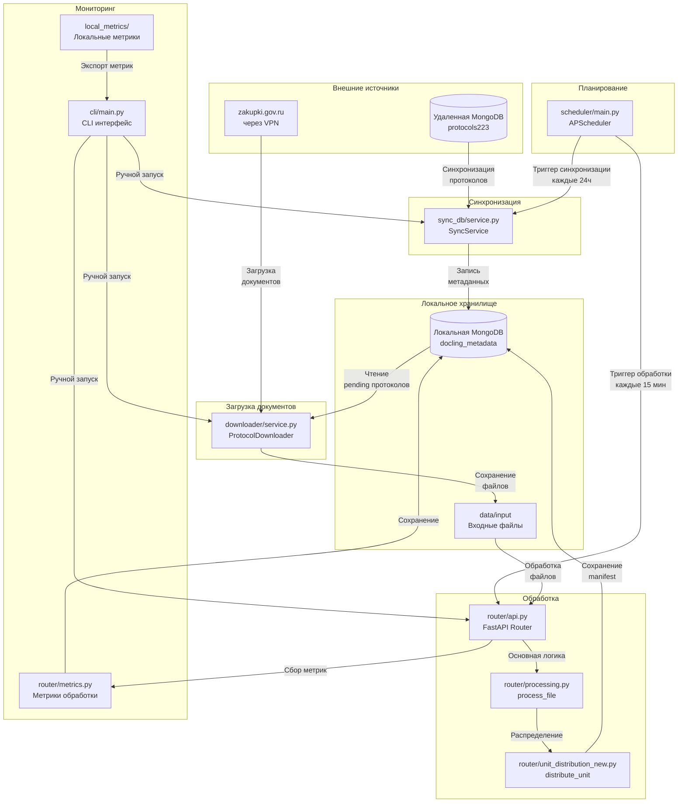
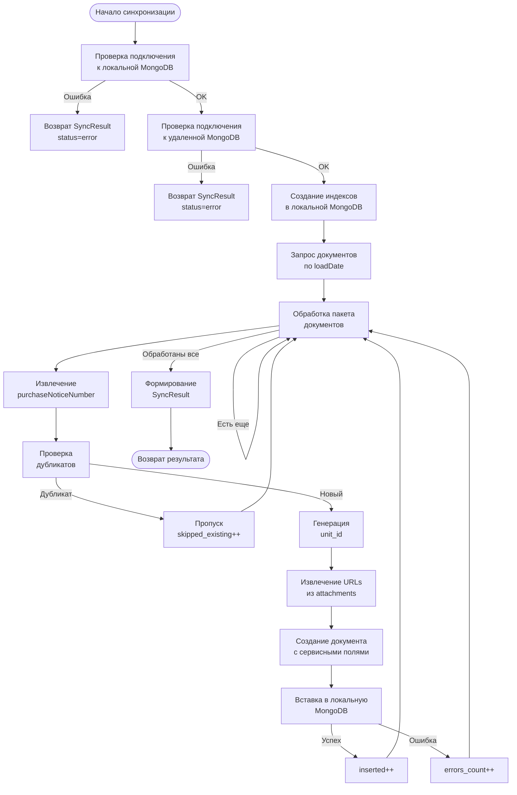
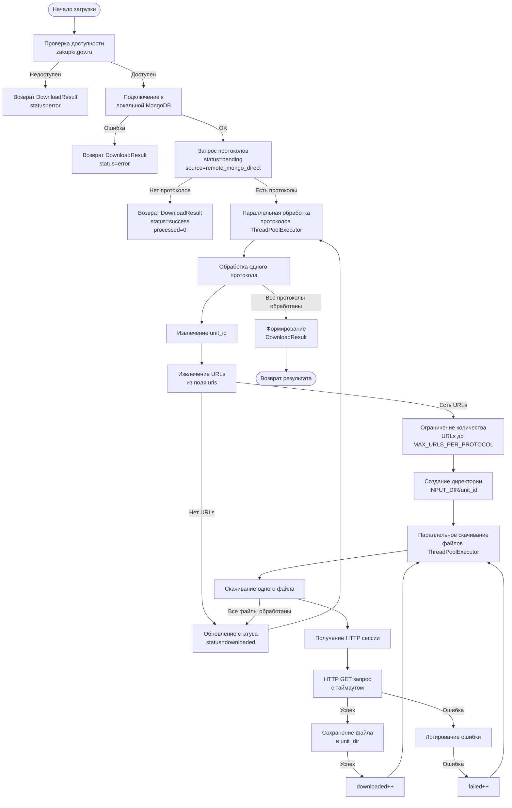
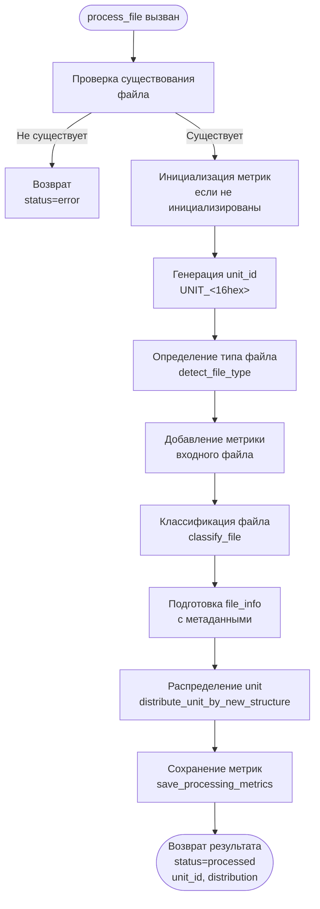
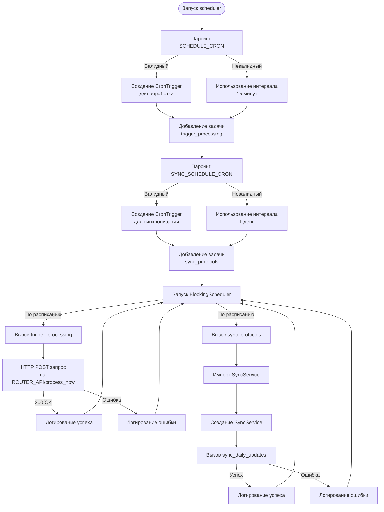
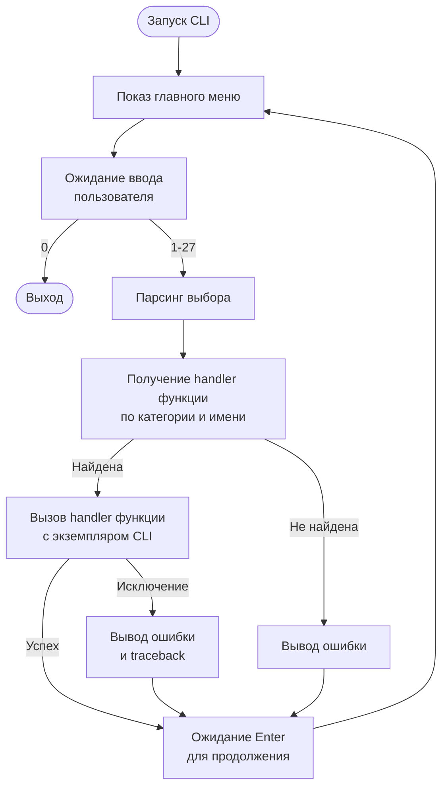
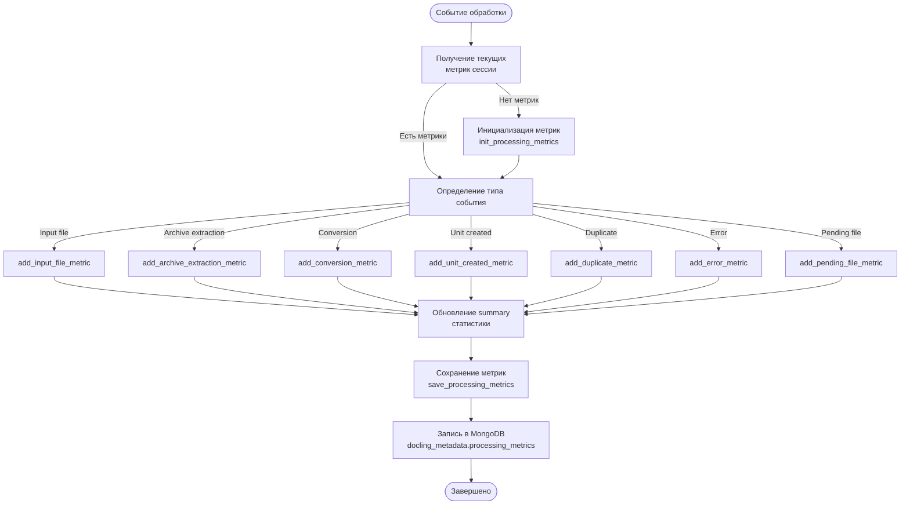
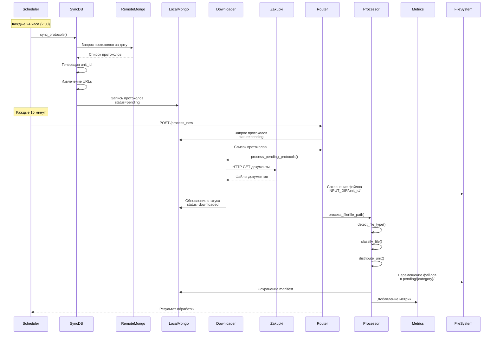

# Схема работы pipeline препроцессинга

**Дата создания:** 2025-01-17  
**Версия:** 1.0

## Общая архитектура системы

### Высокоуровневая схема потока данных



---

## Детальное описание компонентов

### 1. Sync DB Service (`preprocessing/sync_db/service.py`)

**Назначение:** Синхронизация протоколов из удаленной MongoDB в локальную MongoDB.

#### Входные данные:
- **Конфигурация:**
  - `MONGO_SERVER` - адрес удаленной MongoDB (192.168.0.46:8635)
  - `MONGO_USER`, `MONGO_PASSWORD` - учетные данные для удаленной MongoDB
  - `MONGO_SSL_CERT` - путь к SSL сертификату
  - `LOCAL_MONGO_SERVER` - адрес локальной MongoDB
  - `LOCAL_MONGO_USER`, `LOCAL_MONGO_PASSWORD` - учетные данные для локальной MongoDB
- **Параметры:**
  - `target_date: datetime` - дата для синхронизации (опционально, по умолчанию вчера)
  - `limit: int` - лимит количества документов (опционально)

#### Процесс работы:



#### Выходные данные:
- **SyncResult (dataclass):**
  - `status: str` - "success", "partial", "error"
  - `message: str` - текстовое сообщение
  - `date: str` - дата синхронизации
  - `scanned: int` - количество просмотренных документов
  - `inserted: int` - количество вставленных документов
  - `skipped_existing: int` - количество пропущенных дубликатов
  - `errors_count: int` - количество ошибок
  - `duration: float` - время выполнения в секундах
  - `errors: List[str]` - список ошибок

#### Методы:
1. `sync_protocols_for_date(target_date, limit)` - синхронизация за одну дату
2. `sync_protocols_for_date_range(start_date, end_date, limit)` - синхронизация за диапазон дат
3. `sync_daily_updates(limit)` - ежедневное обновление (вчерашний день)
4. `sync_full_collection(days)` - полная синхронизация за N дней

---

### 2. Downloader Service (`preprocessing/downloader/service.py`)

**Назначение:** Скачивание документов с zakupki.gov.ru для протоколов со статусом "pending".

#### Входные данные:
- **Конфигурация:**
  - `MONGO_METADATA_DB` - имя локальной базы данных
  - `MONGO_METADATA_PROTOCOLS_COLLECTION` - коллекция протоколов
  - `INPUT_DIR` - директория для сохранения файлов
  - `MAX_URLS_PER_PROTOCOL` - максимальное количество URL на протокол (по умолчанию 15)
  - `DOWNLOAD_HTTP_TIMEOUT` - таймаут HTTP запросов (по умолчанию 120 сек)
  - `DOWNLOAD_CONCURRENCY` - количество параллельных загрузок (по умолчанию 20)
  - `PROTOCOLS_CONCURRENCY` - количество параллельно обрабатываемых протоколов (по умолчанию 20)
- **Параметры:**
  - `limit: int` - максимальное количество протоколов для обработки

#### Процесс работы:



#### Выходные данные:
- **DownloadResult (dataclass):**
  - `status: str` - "success", "partial", "error"
  - `message: str` - текстовое сообщение
  - `processed: int` - количество обработанных протоколов
  - `downloaded: int` - количество скачанных документов
  - `failed: int` - количество ошибок
  - `duration: float` - время выполнения в секундах
  - `errors: List[str]` - список ошибок

#### Методы:
1. `process_pending_protocols(limit)` - обработка ожидающих протоколов

#### Особенности:
- Использует ThreadPoolExecutor для параллельной обработки протоколов и файлов
- Создает отдельную директорию для каждого unit_id
- Обновляет статус протокола в MongoDB после успешной загрузки

---

### 3. Router Service (`preprocessing/router/api.py`)

**Назначение:** FastAPI сервис для обработки файлов, классификации и распределения по категориям.

#### Входные данные:
- **HTTP Endpoints:**
  - `POST /upload` - загрузка файла через API (UploadFile)
  - `POST /webhook` - webhook для внешних триггеров (dict с file_path)
  - `POST /process_now` - обработка всех файлов из INPUT_DIR
  - `GET /status/{unit_id}` - получение статуса обработки unit
  - `GET /metrics/processing` - получение метрик обработки
  - `GET /protocols/{date}` - получение протоколов по дате
  - `POST /download_protocols/{date}` - скачивание и обработка протоколов за дату

#### Процесс работы (process_file):



#### Процесс работы (distribute_unit_by_new_structure):

```mermaid
flowchart TD
    Start([Распределение unit]) --> EnsureDirs[Создание директорий<br/>pending/*]
    EnsureDirs --> ProcessFiles[Обработка каждого файла]
    ProcessFiles --> DetectType[Определение типа файла<br/>если не определен]
    DetectType --> Classify[Классификация файла<br/>classify_file]
    Classify --> CheckDuplicate[Проверка дубликатов<br/>detect_duplicates_in_unit]
    CheckDuplicate -->|Есть дубликаты| MarkDuplicates[Пометка дубликатов<br/>в метаданных]
    CheckDuplicate -->|Нет дубликатов| CheckMixed[Проверка mixed unit<br/>classify_unit_files]
    MarkDuplicates --> CheckMixed
    CheckMixed -->|Mixed unit| ProcessMixed[Обработка mixed unit<br/>process_mixed_unit]
    CheckMixed -->|Не mixed| GetTargetDir[Определение целевой<br/>директории по категории]
    GetTargetDir --> CreateUnitDir[Создание директории<br/>pending/{category}/unit_id/files]
    CreateUnitDir --> MoveFile[Перемещение файла<br/>в целевую директорию]
    MoveFile --> AddMetric[Добавление метрики<br/>pending файла]
    AddMetric --> SaveMetadata[Сохранение метаданных<br/>unit metadata.json]
    ProcessMixed --> SaveMetadata
    ProcessFiles -->|Есть еще файлы| ProcessFiles
    ProcessFiles -->|Все обработаны| Return([Возврат результата<br/>distribution_result])
```

#### Выходные данные:
- **Результат process_file:**
  ```python
  {
      "status": "processed" | "error",
      "unit_id": str,
      "file": str,
      "size": int,
      "detected_type": str,
      "category": str,
      "distribution": {
          "files_processed": int,
          "files_by_category": dict,
          "duplicates_detected": bool
      },
      "path": str
  }
  ```

- **Результат distribute_unit_by_new_structure:**
  ```python
  {
      "unit_id": str,
      "files_processed": int,
      "files_by_category": {
          "direct": int,
          "normalize": int,
          "convert": int,
          "extract": int,
          "special": int,
          "mixed": int
      },
      "duplicates_detected": bool,
      "duplicate_count": int,
      "errors": list,
      "distributed_files": list
  }
  ```

#### Основные модули:
1. **file_detection.py** - определение типа файла через magic bytes
2. **file_classifier.py** - классификация файлов по категориям обработки
3. **unit_distribution_new.py** - распределение файлов по pending директориям
4. **duplicate_detection.py** - обнаружение дубликатов по SHA256
5. **metrics.py** - сбор и сохранение метрик обработки
6. **manifest.py** - создание manifest.json с метаданными
7. **archive.py** - безопасная распаковка архивов
8. **mongo.py** - работа с MongoDB (чтение/запись метаданных)

---

### 4. Scheduler Service (`preprocessing/scheduler/main.py`)

**Назначение:** Периодический запуск задач обработки через APScheduler.

#### Входные данные:
- **Конфигурация:**
  - `ROUTER_API` - URL endpoint router для обработки (по умолчанию http://router:8080/process_now)
  - `SCHEDULE_CRON` - cron выражение для запуска обработки (по умолчанию */15 * * * * - каждые 15 минут)
  - `SYNC_SCHEDULE_CRON` - cron выражение для синхронизации протоколов (по умолчанию 0 2 * * * - каждый день в 2:00)

#### Процесс работы:



#### Выходные данные:
- Логирование в консоль результатов выполнения задач
- HTTP ответ от router API (для trigger_processing)

#### Задачи:
1. **trigger_processing()** - вызывает POST запрос на `/process_now` endpoint router
2. **sync_protocols()** - импортирует и вызывает SyncService.sync_daily_updates()

#### Особенности:
- Использует BlockingScheduler (блокирующий планировщик)
- Поддерживает как cron выражения, так и интервалы
- Автоматически обрабатывает ошибки парсинга cron и использует значения по умолчанию

---

### 5. CLI Service (`preprocessing/cli/main.py`)

**Назначение:** Интерактивный интерфейс командной строки для тестирования и ручного управления компонентами.

#### Входные данные:
- **Интерактивный выбор из меню:**
  - Категория "ЗАГРУЗКА И ПОДГОТОВКА ДАННЫХ" (пункты 1-3)
  - Категория "ТЕСТИРОВАНИЕ ЭТАПОВ ПРЕПРОЦЕССИНГА" (пункты 4-8)
  - Категория "ПОШАГОВАЯ ОБРАБОТКА" (пункты 9-14)
  - Категория "РАСШИРЕННАЯ СТАТИСТИКА" (пункты 15-17)
  - Категория "MERGE И ФИНАЛИЗАЦИЯ" (пункты 18-19)
  - Категория "ПОЛНОЕ ТЕСТИРОВАНИЕ PIPELINE" (пункты 20-21)
  - Категория "МОНИТОРИНГ И СТАТИСТИКА" (пункты 22-24)
  - Категория "СЛУЖЕБНЫЕ ФУНКЦИИ" (пункты 25-27)

#### Процесс работы:



#### Выходные данные:
- Результаты выполнения команд в консоль
- Метрики и статистика
- Отчеты о выполненных операциях

#### Основные handler категории:
1. **load_handlers.py** - синхронизация протоколов, скачивание, проверка файлов
2. **test_handlers.py** - тестирование отдельных этапов обработки
3. **step_handlers.py** - пошаговая обработка файлов
4. **stats_handlers.py** - статистика и отчеты
5. **merge_handlers.py** - объединение результатов
6. **pipeline_handlers.py** - полное тестирование pipeline
7. **monitor_handlers.py** - мониторинг и просмотр метрик
8. **utils_handlers.py** - служебные функции

---

### 6. Metrics Service (`preprocessing/router/metrics.py` и `preprocessing/local_metrics/`)

**Назначение:** Сбор, хранение и экспорт метрик обработки документов.

#### Входные данные:
- **События обработки:**
  - Инициализация сессии обработки
  - Обработка входного файла
  - Распаковка архива
  - Конвертация документа
  - Создание unit
  - Обнаружение дубликатов
  - Ошибки обработки

#### Процесс работы:



#### Выходные данные:
- **Структура метрик:**
  ```python
  {
      "session_id": str,
      "started_at": str (ISO datetime),
      "completed_at": str (ISO datetime) | None,
      "input_files": list,
      "archives_extracted": list,
      "conversions": list,
      "units_created": list,
      "errors": list,
      "pending_processing": {
          "normalize": list,
          "convert": list,
          "extract": list
      },
      "duplicates": list,
      "summary": {
          "total_input_files": int,
          "total_archives": int,
          "total_extracted": int,
          "total_units": int,
          "total_errors": int,
          "by_extension": dict,
          "by_detected_type": dict,
          "pdf_statistics": dict,
          "doc_conversion_statistics": dict,
          "pending_statistics": dict,
          "duplicate_statistics": dict
      }
  }
  ```

#### Методы:
1. `init_processing_metrics()` - инициализация новой сессии метрик
2. `get_current_metrics()` - получение текущих метрик
3. `save_processing_metrics()` - сохранение метрик в MongoDB
4. `add_input_file_metric()` - добавление метрики входного файла
5. `add_archive_extraction_metric()` - добавление метрики распаковки архива
6. `add_conversion_metric()` - добавление метрики конвертации
7. `add_unit_created_metric()` - добавление метрики создания unit
8. `add_duplicate_metric()` - добавление метрики дубликата
9. `add_error_metric()` - добавление метрики ошибки
10. `add_pending_file_metric()` - добавление метрики pending файла

---

## Полный поток обработки документа

### От синхронизации до готового результата



---

## Структура директорий

### Входные данные:
- `data/input/` - исходные файлы для обработки
- `data/input/{unit_id}/` - файлы скачанных протоколов

### Промежуточная обработка:
- `data/pending/direct/` - файлы с корректным именем и расширением
- `data/pending/normalize/` - файлы с неправильным расширением
- `data/pending/convert/` - файлы для конвертации (doc->docx)
- `data/pending/extract/` - архивы для распаковки
- `data/pending/special/` - подписи, неподдерживаемые форматы
- `data/pending/mixed/` - смешанные units (разные типы файлов)

### Результаты:
- `data/normalized/` - нормализованные units с manifest.json
- `data/output/` - результаты обработки Docling
- `data/archive/` - архив исходных файлов

---

## Состояния данных в системе

### Состояния протоколов (в MongoDB):
1. **pending** - протокол синхронизирован, документы не скачаны
2. **downloaded** - документы скачаны, готовы к обработке
3. **processing** - в процессе обработки (опционально)
4. **processed** - обработка завершена (опционально)
5. **error** - ошибка обработки (опционально)

### Состояния файлов (в router):
1. **input** - файл в директории input
2. **pending/{category}** - файл распределен по категории
3. **normalized** - файл нормализован, создан manifest
4. **processed** - файл обработан Docling

---

## Зависимости между компонентами

### Синхронные вызовы:
- Scheduler → Router (HTTP POST)
- Router → Downloader (прямой вызов Python)
- Router → SyncDB (прямой вызов Python, через scheduler)

### Асинхронные операции:
- Downloader → Zakupki (HTTP GET, параллельно)
- Downloader → FileSystem (запись файлов, параллельно)

### Хранилище данных:
- SyncDB ↔ RemoteMongo (синхронная запись)
- SyncDB → LocalMongo (синхронная запись)
- Downloader ↔ LocalMongo (чтение/запись статусов)
- Router ↔ LocalMongo (чтение/запись метаданных и метрик)
- Metrics → LocalMongo (запись метрик)

---

## Ключевые точки интеграции

1. **MongoDB как единая точка данных:**
   - Хранение протоколов (docling_metadata.protocols)
   - Хранение метаданных units (docling_metadata.manifests)
   - Хранение метрик (docling_metadata.processing_metrics)

2. **Файловая система как промежуточное хранилище:**
   - INPUT_DIR - входные файлы
   - PENDING_DIR - промежуточная обработка
   - NORMALIZED_DIR - готовые к обработке units
   - OUTPUT_DIR - результаты Docling

3. **HTTP API как интерфейс взаимодействия:**
   - Router предоставляет REST API для внешних систем
   - Scheduler вызывает Router через HTTP

4. **CLI как инструмент управления:**
   - Ручной запуск всех компонентов
   - Тестирование отдельных этапов
   - Мониторинг и статистика

---

## Производительность и масштабируемость

### Текущие ограничения:
- **SyncDB:** последовательная обработка батчей (batch_size=1000)
- **Downloader:** параллельная обработка протоколов (PROTOCOLS_CONCURRENCY=20), параллельная загрузка файлов (DOWNLOAD_CONCURRENCY=20)
- **Router:** последовательная обработка файлов из INPUT_DIR
- **Scheduler:** однопоточный планировщик (BlockingScheduler)

### Потенциал для улучшения:
- Асинхронная обработка в Router (FastAPI async endpoints)
- Очереди задач для распределенной обработки
- Кэширование результатов детекции типов файлов
- Батчинг операций с MongoDB

---

**Документ подготовлен:** 2025-01-17  
**Версия:** 1.0

