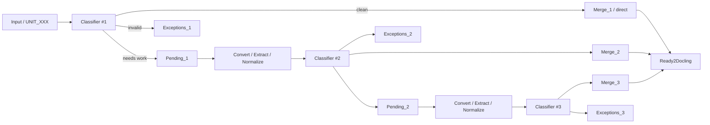

# 📄 Product Requirements Document (PRD)

## Компонент: Preprocessing / Intake Units for Docling

---

## 1. Цель компонента

Компонент **Preprocessing** отвечает за подготовку *юнитов документов (protocol units)* к последующей обработке в **Docling pipeline**.

### Что такое UNIT_XXX (уточнение)

**UNIT_XXX** — это директория, жёстко связанная с **ID протокола в базе данных**.

Соответствие:

* **1 запись в БД (протокол)** → **1 UNIT_XXX**
* **1 UNIT_XXX** может содержать:

  * несколько URL из одной записи БД;
  * несколько скачанных файлов;
  * части одного документа (например, постраничные PDF или изображения);
  * архивы, содержащие документы или их части.

Таким образом:

* UNIT — это **логическая бизнес-единица**, а не отдельный файл;
* все файлы внутри UNIT обрабатываются **совместно**;
* UNIT никогда не дробится между директориями.

**Результат работы компонента:**

> Все UNIT_XXX приведены в корректное состояние и собраны в директории `Ready2Docling`, полностью готовые к обработке Docling без дополнительных проверок.

## 2. Основные принципы

1. **Изоляция юнита**
   Один юнит = одна директория. Юниты никогда не смешиваются.

2. **Итеративная обработка**
   Каждый юнит может проходить до **3 циклов** обработки.

3. **Idempotency**
   Каждый шаг (convert / extract / normalize) оставляет след в структуре директорий и метаданных.

4. **Classifier как центральный маршрутизатор**
   После каждого шага обработки результат **обязательно** повторно классифицируется.

5. **Сортировка по расширениям файлов**
   Все UNIT_XXX в каждой категории (convert, direct, normalize, extracted, converted, normalized, ready_docling) **обязательно** размещаются в поддиректориях по расширению файлов (detected_type). Это обеспечивает:
   * быстрый поиск и навигацию по типам файлов;
   * логическую группировку для последующей обработки;
   * прозрачность структуры данных.
   
   **Пример:**
   ```
   pending/convert/doc/Unit_123/     # UNIT с файлами .doc
   pending/direct/pdf/Unit_456/      # UNIT с файлами .pdf
   ready_docling/docx/Unit_789/     # UNIT с файлами .docx
   ```

---

## 2.1 Детализация принципа сортировки по расширениям

### Назначение

Сортировка UNIT_XXX по расширениям файлов применяется **во всех категориях**, содержащих UNIT_XXX:

* `Pending_N/convert/` → поддиректории по исходному расширению (doc, xls, ppt, rtf)
* `Pending_N/archives/` → поддиректории по типу архива (zip, rar, 7z)
* `Pending_N/direct/` → поддиректории по расширению (docx, jpeg, jpg, pdf, png, pptx, rtf, tiff, xlsx, xml)
* `Pending_N/normalize/` → поддиректории по целевому расширению (docx, pdf, jpeg, jpg, png, pptx, rtf, tiff, xlsx, xml)
* `Merge_1/direct/` → поддиректории по расширению (docx, jpeg, jpg, pdf, png, pptx, rtf, tiff, xlsx, xml)
* `Merge_N/extracted/` → поддиректории по расширению извлечённых файлов
* `Merge_N/converted/` → поддиректории по расширению после конвертации
* `Merge_N/normalized/` → поддиректории по расширению после нормализации
* `Ready2Docling/` → поддиректории по расширению готовых файлов (для PDF дополнительно: pdf/scan/, pdf/text/)

### Правила определения расширения

1. **Приоритет:** используется `detected_type` из Classifier (определяется через magic bytes и MIME)
2. **Для convert:** используется исходное расширение файла (doc, xls, ppt)
3. **Для normalize:** используется целевое расширение после нормализации
4. **Для direct/extracted/converted:** используется финальное расширение файла

### Исключения

* **PDF файлы в Ready2Docling:** дополнительно сортируются на `pdf/scan/` и `pdf/text/` на основе классификации PDF
* **Архивы:** могут не иметь поддиректорий по расширению до извлечения, либо сортируются по типу архива (zip, rar, 7z)

---

## 3. Входные данные (Input)

### 3.1 Input-директория

* Все файлы скачиваются по URL
* Первичная сортировка **только по юнитам**
* Никакой обработки на этом этапе

```
Input/
 └── Unit_XXXX/
     ├── file_1
     ├── file_2
     └── archive_1
```

---

## 4. Classifier (ключевой компонент)

### 4.1 Назначение

Classifier выполняет:

* определение **истинного типа файла**;
* проверку соответствия имени и реального содержимого;
* маршрутизацию юнитов по кластерам.

### 4.2 Методы детекции

* MIME / python-библиотеки
* сигнатуры начала файла (magic bytes)
* логические проверки имени и расширения

---

## 5. Кластер Pending (требуют обработки)

### 5.1 Назначение

Хранит юниты, которые **нельзя напрямую** передать в Docling.

Каждый цикл имеет собственную директорию:

* `Pending_1`
* `Pending_2`
* `Pending_3`

### 5.2 Поддиректории Pending

#### 1️⃣ Convert

Файлы требуют конвертации формата:

* doc → docx
* xls → xlsx
* другие поддерживаемые преобразования

**Структура сортировки по расширениям:**

UNIT_XXX размещаются в поддиректориях по расширению файлов:

```
Pending_N/convert/
 ├── doc/          # UNIT_XXX с файлами .doc
 ├── xls/          # UNIT_XXX с файлами .xls
 ├── ppt/          # UNIT_XXX с файлами .ppt
 ├── rtf/          # UNIT_XXX с файлами .rtf
 └── ...           # другие форматы, требующие конвертации
```

#### 2️⃣ Archives

Файлы требуют разархивации:

* zip
* rar
* 7z
* другие архивные форматы

**Структура сортировки по расширениям:**

```
Pending_N/archives/
 ├── zip/          # UNIT_XXX с архивами .zip
 ├── rar/          # UNIT_XXX с архивами .rar
 ├── 7z/           # UNIT_XXX с архивами .7z
 └── ...           # другие архивные форматы
```

#### 3️⃣ Direct

Файлы, которые **не требуют обработки** и могут быть переданы в Docling напрямую:

**Условия попадания в direct:**

* файлы имеют корректное расширение;
* расширение соответствует содержимому (определено через Classifier);
* формат поддерживается Docling pipeline.

**Структура сортировки по расширениям:**

```
Pending_N/direct/
 ├── docx/        # UNIT_XXX с файлами .docx
 ├── jpeg/        # UNIT_XXX с файлами .jpeg
 ├── jpg/         # UNIT_XXX с файлами .jpg
 ├── pdf/         # UNIT_XXX с файлами .pdf
 ├── png/         # UNIT_XXX с файлами .png
 ├── pptx/        # UNIT_XXX с файлами .pptx
 ├── rtf/         # UNIT_XXX с файлами .rtf
 ├── tiff/        # UNIT_XXX с файлами .tiff
 ├── xlsx/        # UNIT_XXX с файлами .xlsx
 ├── xml/         # UNIT_XXX с файлами .xml
 └── ...          # другие поддерживаемые форматы
```

**Примечание:** После первого цикла Classifier, UNIT_XXX из `Pending_N/direct/` перемещаются в `Merge_1/direct/` с сохранением структуры по расширениям.

#### 4️⃣ Normalize

Файлы требуют исправления имени или расширения:

**Типовые кейсы:**

* смещённая точка в имени (`file.epdf → file.pdf`)
* расширение не соответствует содержимому (`file.doc → file.rar`)
* проблема решается **переименованием**, без конвертации

**Структура сортировки по расширениям:**

UNIT_XXX размещаются в поддиректориях по **целевому типу файла** (detected_type после нормализации):

```
Pending_N/normalize/
 ├── docx/        # UNIT_XXX с файлами, требующими нормализации к .docx
 ├── pdf/         # UNIT_XXX с файлами, требующими нормализации к .pdf
 ├── jpeg/        # UNIT_XXX с файлами, требующими нормализации к .jpeg
 ├── jpg/         # UNIT_XXX с файлами, требующими нормализации к .jpg
 ├── png/         # UNIT_XXX с файлами, требующими нормализации к .png
 ├── pptx/        # UNIT_XXX с файлами, требующими нормализации к .pptx
 ├── rtf/         # UNIT_XXX с файлами, требующими нормализации к .rtf
 ├── tiff/        # UNIT_XXX с файлами, требующими нормализации к .tiff
 ├── xlsx/        # UNIT_XXX с файлами, требующими нормализации к .xlsx
 ├── xml/         # UNIT_XXX с файлами, требующими нормализации к .xml
 └── ...          # другие форматы
```

---

## 6. Кластер Exceptions

### 6.1 Назначение

Хранит юниты, которые:

* не имеют бизнес-ценности;
* не могут быть корректно обработаны;
* требуют отдельной логики в будущем.

Аналогично Pending, поддерживает циклы:

* `Exceptions_1`
* `Exceptions_2`
* `Exceptions_3`

### 6.2 Поддиректории Exceptions

#### 1️⃣ special

* подписи
* системный мусор
* файлы без документарной ценности

#### 2️⃣ mixed

* смешанные типы файлов внутри одного юнита
* отложены до реализации специальной логики

#### 3️⃣ unknown

* тип файла не определён
* pipeline не подобран

---

## 7. Кластер Merge (готовые к Docling)

### 7.1 Назначение

Хранит **уже валидные юниты**, не требующие дальнейшей обработки.

Поддерживает циклы:

* `Merge_1`
* `Merge_2`
* `Merge_3`

### 7.2 Логика поддиректорий Merge (уточнение)

#### Merge_1

* **Содержит ТОЛЬКО поддиректорию `direct`**
* Юниты попадают сюда **сразу после первого прогона Classifier**
* Условие: все файлы в юните изначально корректны
* **Никакой preprocessing не выполнялся**

**Структура сортировки по расширениям:**

```
Merge_1/
 └── direct/
     ├── docx/     # UNIT_XXX с файлами .docx
     ├── jpeg/     # UNIT_XXX с файлами .jpeg
     ├── jpg/      # UNIT_XXX с файлами .jpg
     ├── pdf/      # UNIT_XXX с файлами .pdf
     ├── png/      # UNIT_XXX с файлами .png
     ├── pptx/     # UNIT_XXX с файлами .pptx
     ├── rtf/      # UNIT_XXX с файлами .rtf
     ├── tiff/     # UNIT_XXX с файлами .tiff
     ├── xlsx/     # UNIT_XXX с файлами .xlsx
     ├── xml/      # UNIT_XXX с файлами .xml
     └── ...       # другие поддерживаемые форматы
         └── Unit_XXXX/
```

#### Merge_2 и Merge_3

* **НЕ содержат `direct`**
* Содержат ТОЛЬКО результаты обработки
* Каждый юнит прошёл хотя бы один preprocessing-шаг

Допустимые поддиректории:

* `extracted`
* `converted`
* `normalized`

**Структура сортировки по расширениям:**

```
Merge_2/
 ├── extracted/
 │   ├── docx/     # UNIT_XXX извлечённые из архивов с .docx
 │   ├── pdf/      # UNIT_XXX извлечённые из архивов с .pdf
 │   └── ...
 ├── converted/
 │   ├── docx/     # UNIT_XXX конвертированные в .docx
 │   ├── xlsx/     # UNIT_XXX конвертированные в .xlsx
 │   └── ...
 └── normalized/
     ├── docx/     # UNIT_XXX нормализованные к .docx
     ├── pdf/      # UNIT_XXX нормализованные к .pdf
     └── ...

Merge_3/
 ├── extracted/
 ├── converted/
 └── normalized/
     └── [структура аналогична Merge_2]
```

## 8. Итеративный цикл обработки

1. Classifier → маршрутизация
2. Pending → обработка (convert / extract / normalize)
3. Повторный Classifier
4. Перемещение в:

   * Merge (успех)
   * Pending следующего цикла
   * Exceptions
5. Максимум **3 итерации**

---

## 9. Финальный Merge

После завершения 3 циклов:

* все данные из:

  * `Merge_1`
  * `Merge_2`
  * `Merge_3`
* всех их поддиректорий

➡️ объединяются в:

```
Ready2Docling/
 ├── docx/         # UNIT_XXX с файлами .docx
 ├── jpeg/         # UNIT_XXX с файлами .jpeg
 ├── jpg/          # UNIT_XXX с файлами .jpg
 ├── pdf/          # UNIT_XXX с файлами .pdf
 │   ├── scan/     # PDF сканированные (для Docling OCR)
 │   └── text/     # PDF текстовые (для Docling Text Extraction)
 ├── png/          # UNIT_XXX с файлами .png
 ├── pptx/         # UNIT_XXX с файлами .pptx
 ├── rtf/          # UNIT_XXX с файлами .rtf
 ├── tiff/         # UNIT_XXX с файлами .tiff
 ├── xlsx/         # UNIT_XXX с файлами .xlsx
 ├── xml/          # UNIT_XXX с файлами .xml
 └── ...
     └── Unit_XXXX/
```

**Важно:** Все UNIT_XXX в Ready2Docling **обязательно** отсортированы по расширениям файлов в соответствующие поддиректории. Это обеспечивает корректную маршрутизацию в Docling pipeline.

На этом этапе **Preprocessing завершён**.

---

## 10. Границы ответственности

### Компонент Preprocessing:

* файловая подготовка
* классификация
* трассируемость изменений

### Docling Pipeline:

* семантический анализ
* AST / nodes / edges
* бизнес-логика

---

## 11. Структуры директорий (пример по дате)

### 📅 2025-03-18

#### Input

```
Input/2025-03-18/
 └── Unit_0001/
```

#### Pending + Exceptions

```
Processing/2025-03-18/
 ├── Pending_1/
 │   ├── convert/
 │   │   ├── doc/      # UNIT_XXX с .doc
 │   │   ├── xls/      # UNIT_XXX с .xls
 │   │   ├── ppt/      # UNIT_XXX с .ppt
 │   │   └── rtf/      # UNIT_XXX с .rtf
 │   ├── archives/
 │   │   ├── zip/      # UNIT_XXX с .zip
 │   │   ├── rar/      # UNIT_XXX с .rar
 │   │   └── 7z/       # UNIT_XXX с .7z
 │   ├── direct/
 │   │   ├── docx/     # UNIT_XXX с .docx
 │   │   ├── pdf/      # UNIT_XXX с .pdf
 │   │   ├── jpeg/     # UNIT_XXX с .jpeg
 │   │   └── ...
 │   └── normalize/
 │       ├── docx/     # UNIT_XXX для нормализации к .docx
 │       ├── pdf/      # UNIT_XXX для нормализации к .pdf
 │       ├── jpeg/     # UNIT_XXX для нормализации к .jpeg
 │       └── ...
 ├── Pending_2/
 │   └── [аналогичная структура]
 ├── Pending_3/
 │   └── [аналогичная структура]
 ├── Exceptions_1/
 │   ├── special/
 │   ├── mixed/
 │   └── unknown/
 ├── Exceptions_2/
 └── Exceptions_3/
```

#### Merge

```
Merge/2025-03-18/
 ├── Merge_1/
 │   └── direct/
 │       ├── docx/     # UNIT_XXX с .docx
 │       ├── pdf/      # UNIT_XXX с .pdf
 │       ├── jpeg/     # UNIT_XXX с .jpeg
 │       └── ...
 ├── Merge_2/
 │   ├── extracted/
 │   │   ├── docx/     # UNIT_XXX извлечённые с .docx
 │   │   └── ...
 │   ├── converted/
 │   │   ├── docx/     # UNIT_XXX конвертированные в .docx
 │   │   └── ...
 │   └── normalized/
 │       ├── pdf/      # UNIT_XXX нормализованные к .pdf
 │       └── ...
 └── Merge_3/
     └── [аналогичная структура]
```

#### Ready

```
Ready2Docling/2025-03-18/
 ├── docx/         # UNIT_XXX с файлами .docx
 ├── jpeg/         # UNIT_XXX с файлами .jpeg
 ├── jpg/          # UNIT_XXX с файлами .jpg
 ├── pdf/          # UNIT_XXX с файлами .pdf
 │   ├── scan/     # PDF сканированные (для Docling OCR)
 │   └── text/     # PDF текстовые (для Docling Text Extraction)
 ├── png/          # UNIT_XXX с файлами .png
 ├── pptx/         # UNIT_XXX с файлами .pptx
 ├── rtf/          # UNIT_XXX с файлами .rtf
 ├── tiff/         # UNIT_XXX с файлами .tiff
 ├── xlsx/         # UNIT_XXX с файлами .xlsx
 ├── xml/          # UNIT_XXX с файлами .xml
 └── ...
     └── Unit_0001/
```

---

## 12. Критерии готовности (Definition of Done)

* [ ] Все юниты находятся в Ready2Docling
* [ ] Нет файлов в Pending
* [ ] Все изменения трассируемы по циклам
* [ ] Docling может обрабатывать без ошибок

---

## 13. State Machine UNIT (формальная модель)

Ниже описана **детерминированная state machine на уровне UNIT**, где файловая система является материализованным представлением состояний.

### 13.1 Состояния UNIT

```
RAW_INPUT
  │
  ▼
CLASSIFIED_1
  ├──▶ MERGED_1_DIRECT ───────────────▶ READY2DOCLING
  │
  ├──▶ PENDING_1 (convert | extract | normalize)
  │            │
  │            ▼
  │        CLASSIFIED_2
  │            ├──▶ MERGED_2 (extracted | converted | normalized)
  │            │         │
  │            │         ▼
  │            │     READY2DOCLING
  │            │
  │            ├──▶ PENDING_2
  │            │         │
  │            │         ▼
  │            │     CLASSIFIED_3
  │            │         ├──▶ MERGED_3 (extracted | converted | normalized)
  │            │         │         │
  │            │         │         ▼
  │            │         │     READY2DOCLING
  │            │         │
  │            │         └──▶ EXCEPTIONS_3
  │            │
  │            └──▶ EXCEPTIONS_2
  │
  └──▶ EXCEPTIONS_1
```

### 13.2 Инварианты state machine

* UNIT никогда не дробится
* UNIT может находиться **только в одном состоянии**
* Переходы выполняются **только через Classifier**
* Максимум **3 классификационных цикла**

---

## 14. Manifest.json v2 (UNIT-level)

Manifest — это **контракт между preprocessing и Docling execution engine**.

### 14.1 Назначение manifest

* фиксирует связь UNIT ↔ протокол БД
* описывает все трансформации
* гарантирует воспроизводимость
* используется Docling для контекстной интерпретации

### 14.2 Структура manifest.json v2

```json
{
  "schema_version": "2.0",
  "unit_id": "UNIT_000123",
  "protocol_id": "db_protocol_987654",
  "source": {
    "urls": [
      {
        "url": "https://example.gov/doc1",
        "downloaded_at": "2025-03-18T09:12:33Z",
        "http_status": 200
      }
    ]
  },
  "unit_semantics": {
    "domain": "public_procurement",
    "entity": "tender_protocol",
    "expected_content": ["protocol", "attachments"]
  },
  "files": [
    {
      "original_name": "protocol.doc",
      "current_name": "protocol.docx",
      "mime_detected": "application/vnd.openxmlformats-officedocument.wordprocessingml.document",
      "pages_or_parts": 1,
      "transformations": [
        {
          "type": "convert",
          "from": "doc",
          "to": "docx",
          "cycle": 1,
          "tool": "libreoffice",
          "timestamp": "2025-03-18T09:15:10Z"
        }
      ]
    }
  ],
  "processing": {
    "current_cycle": 2,
    "max_cycles": 3,
    "final_cluster": "Merge_2",
    "final_reason": "converted",
    "classifier_confidence": 0.94
  },
  "state_machine": {
    "initial_state": "RAW_INPUT",
    "final_state": "READY2DOCLING",
    "state_trace": [
      "RAW_INPUT",
      "CLASSIFIED_1",
      "PENDING_1_CONVERT",
      "CLASSIFIED_2",
      "MERGED_2_CONVERTED",
      "READY2DOCLING"
    ]
  },
  "integrity": {
    "checksum": "sha256:...",
    "file_count": 1
  }
}
```

---

## 15. Визуальная схема preprocessing (Mermaid)



---

## 16. Контекст проекта: госсзакупки (binding)

Данный preprocessing-компонент спроектирован под задачу:

* анализа протоколов госсзакупок;
* выявления победителей;
* сопоставления документов, решений и приложений;
* устойчивой работы с низким качеством источников.

UNIT = **атомарный протокол закупки**, а Docling далее строит:

* AST документа;
* извлечение сущностей (участники, цены, решения);
* дедукцию победителя.

Preprocessing гарантирует, что Docling получает:

> *структурно корректный, воспроизводимый и трассируемый вход.*

---

## 17. Требования к реализации сортировки по расширениям

### 17.1 Обязательные требования

Все компоненты системы **обязаны** соблюдать принцип сортировки UNIT_XXX по расширениям файлов:

1. **Classifier** должен определять `detected_type` для каждого файла
2. **Маршрутизация UNIT_XXX** должна учитывать расширение при определении целевой директории
3. **Все операции перемещения** должны сохранять структуру поддиректорий по расширениям
4. **Финальный Merge** должен объединять UNIT_XXX с сохранением сортировки по расширениям

### 17.2 Реализация в коде

#### Функция `get_target_directory()`

Должна возвращать путь с учётом расширения:

```python
# Пример для direct
base_pending_dir / "direct" / detected_type / unit_id

# Пример для convert
base_pending_dir / "convert" / source_extension / unit_id

# Пример для normalize
base_pending_dir / "normalize" / target_extension / unit_id
```

#### Функция распределения UNIT_XXX

При перемещении UNIT_XXX должна:

1. Определить расширение файлов в UNIT (через Classifier)
2. Создать поддиректорию по расширению, если не существует
3. Переместить UNIT_XXX в соответствующую поддиректорию

#### Функция финального Merge

При объединении в Ready2Docling должна:

1. Сохранять структуру поддиректорий по расширениям
2. Для PDF дополнительно создавать `pdf/scan/` и `pdf/text/`
3. Гарантировать отсутствие дубликатов UNIT_XXX

### 17.3 Поддерживаемые расширения

**Для convert:**
- doc, xls, ppt, rtf, doc_old

**Для direct/normalize/extracted/converted/normalized/ready_docling:**
- docx, jpeg, jpg, pdf, png, pptx, rtf, tiff, xlsx, xml

**Для archives:**
- zip, rar, 7z

### 17.4 Проверка соответствия

Перед финальным Merge необходимо проверить:

* [ ] Все UNIT_XXX отсортированы по расширениям
* [ ] Структура директорий соответствует требованиям
* [ ] Нет UNIT_XXX в корневых директориях категорий (только в поддиректориях по расширениям)
* [ ] PDF файлы дополнительно отсортированы на scan/text в Ready2Docling

---

## 18. Итог

Компонент preprocessing:

* формализован как state machine;
* имеет строгий контракт (manifest v2);
* реализует сортировку UNIT_XXX по расширениям файлов во всех категориях;
* масштабируем;
* готов к промышленному использованию в контуре госсзакупок.
